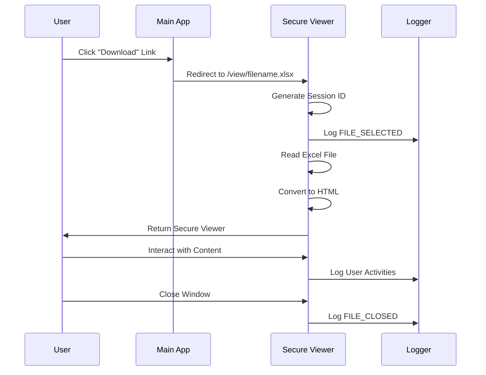
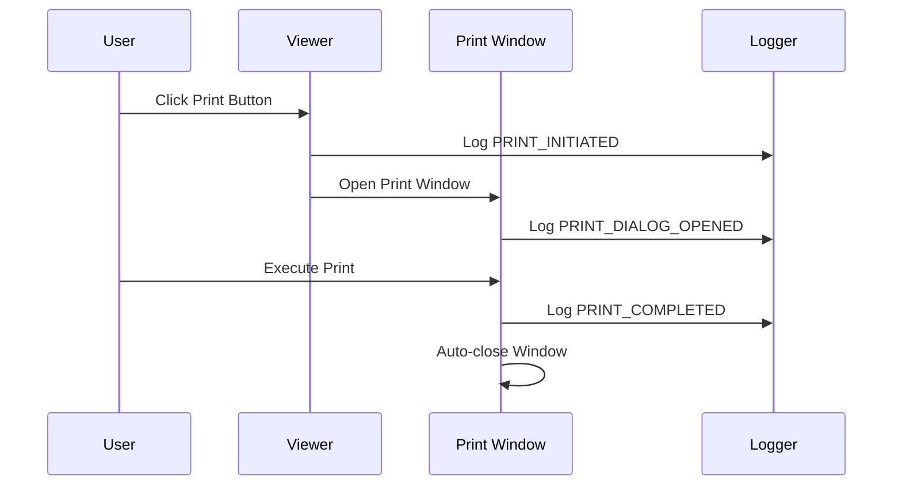

# Secure Excel Viewer - Technical Implementation Guide

## 📋 Table of Contents
1. [System Architecture](#system-architecture)
2. [Security Implementation](#security-implementation)
3. [Activity Tracking System](#activity-tracking-system)
4. [File Flow Process](#file-flow-process)
5. [API Documentation](#api-documentation)
6. [Database Schema](#database-schema)
7. [Frontend Components](#frontend-components)
8. [Deployment Architecture](#deployment-architecture)
9. [Security Considerations](#security-considerations)
10. [Performance Optimization](#performance-optimization)

## 🏗️ System Architecture

### High-Level Architecture
```
┌─────────────────┐    ┌─────────────────┐    ┌─────────────────┐
│   User's Main   │    │   Secure Excel  │    │   Activity      │
│   Application   │────│   Viewer Server │────│   Monitoring    │
│                 │    │                 │    │   Dashboard     │
└─────────────────┘    └─────────────────┘    └─────────────────┘
         │                       │                       │
         │                       │                       │
         ▼                       ▼                       ▼
┌─────────────────┐    ┌─────────────────┐    ┌─────────────────┐
│   File Storage  │    │   Session       │    │   Log Storage   │
│   (secure_files)│    │   Management    │    │   (JSON/DB)     │
└─────────────────┘    └─────────────────┘    └─────────────────┘
```

### Component Breakdown

#### 1. **Flask Application Server** (`app.py`)
- **Purpose**: Core web server handling requests and responses
- **Key Responsibilities**:
  - File serving and access control
  - Session management
  - Activity logging
  - API endpoints
  - Template rendering

#### 2. **Frontend Templates** (`templates/`)
- **index.html**: Main file listing interface
- **viewer.html**: Secure Excel file viewer
- **print.html**: Print-friendly version with watermarks
- **admin.html**: Real-time activity monitoring dashboard

#### 3. **Security Layer**
- **Client-side**: JavaScript-based protection
- **Server-side**: Flask session management and access control
- **File-level**: Pandas Excel parsing (no direct file access)

#### 4. **Activity Tracking System**
- **Real-time logging**: All user interactions captured
- **Persistent storage**: JSON file-based storage
- **API endpoints**: RESTful access to logs

## 🔐 Security Implementation

### Multi-Layer Security Approach

#### Layer 1: Client-Side Protection
```javascript
// Disable text selection
body {
    -webkit-user-select: none;
    -moz-user-select: none;
    -ms-user-select: none;
    user-select: none;
}

// Block keyboard shortcuts
document.addEventListener('keydown', function(e) {
    if ((e.ctrlKey && (e.key === 'c' || e.key === 'a' || e.key === 's' || e.key === 'p')) || 
        e.key === 'F12' || 
        (e.ctrlKey && e.shiftKey && e.key === 'I')) {
        e.preventDefault();
        trackActivity('BLOCKED_SHORTCUT', {key: e.key});
        return false;
    }
});

// Disable right-click context menu
document.addEventListener('contextmenu', function(e) {
    e.preventDefault();
    trackActivity('RIGHT_CLICK_ATTEMPT');
    return false;
});
```

#### Layer 2: Server-Side Protection
```python
@app.route('/view/<filename>')
def view_file(filename):
    # Session validation
    if 'session_id' not in session:
        session['session_id'] = generate_session_id()
    
    # File existence check
    file_path = os.path.join(EXCEL_FILES_DIR, filename)
    if not os.path.exists(file_path):
        log_activity(session['session_id'], 'FILE_NOT_FOUND', filename)
        return "File not found", 404
    
    # File processing (no direct file serving)
    df = pd.read_excel(file_path, sheet_name=None)
    # Convert to HTML (removes Excel functionality)
```

#### Layer 3: File-Level Protection
- **No Direct Downloads**: Files are never served as downloads
- **HTML Conversion**: Excel files converted to HTML tables
- **Memory Processing**: Files processed in memory, not streamed
- **Access Logging**: Every file access logged with metadata

### Security Features Matrix

| Feature | Implementation | Effectiveness | Bypass Difficulty |
|---------|---------------|---------------|-------------------|
| Copy Protection | CSS + JS | High | Medium |
| Right-click Block | Event Handlers | High | Medium |
| Keyboard Shortcuts | Key Event Blocking | High | Medium |
| Developer Tools Detection | Screen Size Monitoring | Medium | High |
| Text Selection | CSS user-select | High | Low |
| Drag & Drop Block | Event Prevention | High | Medium |
| Print Watermarking | CSS @media print | High | Low |
| Session Tracking | Server-side Sessions | Very High | Very High |

## 📊 Activity Tracking System

### Data Collection Architecture

#### Event Capture Points
```javascript
// File-level events
trackActivity('FILE_OPENED', {metadata});
trackActivity('FILE_CLOSED', {duration, interactions});

// User interaction events
trackActivity('CLICK_EVENT', {x, y, element});
trackActivity('SCROLL_ACTIVITY', {position, count});
trackActivity('SHEET_SWITCHED', {sheet_name});

// Security events
trackActivity('BLOCKED_SHORTCUT', {key, timestamp});
trackActivity('DEVTOOLS_OPENED', {detection_method});

// Time-based events
trackActivity('TIME_TRACKING', {seconds_spent});
```

#### Data Structure
```json
{
  "timestamp": "2025-08-29T10:30:45.123Z",
  "session_id": "uuid-v4-string",
  "activity": "ACTIVITY_TYPE",
  "file_name": "document.xlsx",
  "ip_address": "192.168.1.100",
  "user_agent": "Mozilla/5.0 (Windows NT 10.0; Win64; x64)...",
  "additional_info": {
    "custom_field_1": "value1",
    "custom_field_2": "value2",
    "metadata": {}
  }
}
```

### Activity Types Catalog

#### File Operations
- `HOMEPAGE_LOADED` - User accessed main page
- `FILE_SELECTED` - User clicked on file
- `FILE_OPENED` - File successfully loaded
- `FILE_VIEWED` - File content displayed
- `FILE_CLOSED` - User closed file
- `FILE_NOT_FOUND` - Attempted access to non-existent file
- `FILE_ERROR` - Error reading file

#### User Interactions
- `CLICK_EVENT` - User clicked on content
- `SCROLL_ACTIVITY` - User scrolled content
- `SHEET_SWITCHED` - User changed Excel sheet
- `TIME_TRACKING` - Periodic time spent updates
- `WINDOW_FOCUSED` - Window gained focus
- `WINDOW_BLURRED` - Window lost focus
- `PAGE_HIDDEN` - Tab/window hidden
- `PAGE_VISIBLE` - Tab/window visible

#### Print Operations
- `PRINT_INITIATED` - User requested print
- `PRINT_DIALOG_OPENED` - Print dialog displayed
- `PRINT_COMPLETED` - Print job finished
- `PRINT_ERROR` - Print operation failed

#### Security Events
- `BLOCKED_SHORTCUT` - Keyboard shortcut blocked
- `RIGHT_CLICK_ATTEMPT` - Right-click context menu blocked
- `DRAG_ATTEMPT` - Drag operation blocked
- `DEVTOOLS_OPENED` - Developer tools detected
- `DEVTOOLS_CLOSED` - Developer tools closed
- `CONSOLE_ACCESSED` - Console warning triggered

## 🔄 File Flow Process

### Standard File Access Flow


### Print Flow Process


## 🔌 API Documentation

### Endpoints Overview

#### Public Endpoints
```python
GET  /                    # Main file listing page
GET  /view/<filename>     # Secure file viewer
GET  /print/<filename>    # Print-friendly version
POST /track               # Activity tracking endpoint
```

#### Admin Endpoints
```python
GET  /admin/logs          # Admin dashboard (HTML)
GET  /api/logs            # Activity logs (JSON API)
```

### API Specifications

#### POST /track
**Purpose**: Record user activity events

**Request Body**:
```json
{
  "activity": "ACTIVITY_TYPE",
  "filename": "document.xlsx",
  "info": {
    "timestamp": "2025-08-29T10:30:45.123Z",
    "custom_data": "value"
  }
}
```

**Response**:
```json
{
  "status": "logged"
}
```

**Error Response**:
```json
{
  "error": "No session"
}
```

#### GET /api/logs
**Purpose**: Retrieve all activity logs

**Query Parameters**:
- `session_id` (optional): Filter by session
- `activity` (optional): Filter by activity type
- `filename` (optional): Filter by filename
- `limit` (optional): Limit number of results

**Response**:
```json
[
  {
    "timestamp": "2025-08-29T10:30:45.123Z",
    "session_id": "uuid-string",
    "activity": "FILE_OPENED",
    "file_name": "document.xlsx",
    "ip_address": "192.168.1.100",
    "user_agent": "Mozilla/5.0...",
    "additional_info": {}
  }
]
```

## 💾 Database Schema

### Current Implementation (JSON File)
```json
{
  "logs": [
    {
      "id": "auto-generated",
      "timestamp": "ISO-8601-string",
      "session_id": "uuid-v4",
      "activity": "string",
      "file_name": "string",
      "ip_address": "string",
      "user_agent": "string",
      "additional_info": "object"
    }
  ]
}
```

### Recommended Database Schema (PostgreSQL/MySQL)

#### Sessions Table
```sql
CREATE TABLE sessions (
    id UUID PRIMARY KEY DEFAULT gen_random_uuid(),
    session_id VARCHAR(255) UNIQUE NOT NULL,
    ip_address INET,
    user_agent TEXT,
    created_at TIMESTAMP DEFAULT NOW(),
    last_activity TIMESTAMP DEFAULT NOW()
);
```

#### Files Table
```sql
CREATE TABLE files (
    id SERIAL PRIMARY KEY,
    filename VARCHAR(255) UNIQUE NOT NULL,
    file_path TEXT NOT NULL,
    file_size BIGINT,
    mime_type VARCHAR(100),
    created_at TIMESTAMP DEFAULT NOW(),
    last_accessed TIMESTAMP
);
```

#### Activity Logs Table
```sql
CREATE TABLE activity_logs (
    id SERIAL PRIMARY KEY,
    session_id UUID REFERENCES sessions(id),
    file_id INTEGER REFERENCES files(id),
    activity_type VARCHAR(100) NOT NULL,
    additional_info JSONB,
    timestamp TIMESTAMP DEFAULT NOW(),
    
    -- Indexes for performance
    INDEX idx_session_id (session_id),
    INDEX idx_file_id (file_id),
    INDEX idx_activity_type (activity_type),
    INDEX idx_timestamp (timestamp)
);
```

## 🎨 Frontend Components

### Component Architecture

#### Main Page (`index.html`)
```html
<!-- Security Notice Banner -->
<div class="security-notice">
  <!-- Security features information -->
</div>

<!-- File Grid -->
<div class="file-grid">
  <!-- Dynamic file cards -->
</div>

<!-- Activity Monitor Panel -->
<div class="activity-monitor">
  <!-- Real-time status -->
</div>
```

#### Viewer Page (`viewer.html`)
```html
<!-- Fixed Header with Controls -->
<div class="viewer-header">
  <!-- File info and action buttons -->
</div>

<!-- Sheet Navigation Tabs -->
<div class="sheet-tabs">
  <!-- Dynamic sheet tabs -->
</div>

<!-- Content Area -->
<div class="content-area">
  <!-- Excel data as HTML tables -->
</div>

<!-- Security Overlays -->
<div class="watermark">SECURE VIEW</div>
<div class="activity-indicator">Tracking Active</div>
```

### JavaScript Architecture

#### Core Tracking System
```javascript
// Central tracking function
function trackActivity(activity, info = {}) {
    fetch('/track', {
        method: 'POST',
        headers: {'Content-Type': 'application/json'},
        body: JSON.stringify({
            activity: activity,
            filename: filename,
            info: {
                timestamp: new Date().toISOString(),
                ...info
            }
        })
    });
}

// Event listeners setup
function initializeTracking() {
    // Mouse events
    document.addEventListener('click', handleClick);
    document.addEventListener('scroll', handleScroll);
    
    // Keyboard events
    document.addEventListener('keydown', handleKeyboard);
    
    // Window events
    window.addEventListener('focus', handleFocus);
    window.addEventListener('blur', handleBlur);
    
    // Security events
    document.addEventListener('contextmenu', blockRightClick);
    document.addEventListener('dragstart', blockDrag);
}
```

### CSS Security Implementation
```css
/* Disable text selection */
.no-copy {
    -webkit-touch-callout: none;
    -webkit-user-select: none;
    -khtml-user-select: none;
    -moz-user-select: none;
    -ms-user-select: none;
    user-select: none;
}

/* Print-specific styles */
@media print {
    .no-print { display: none !important; }
    .watermark { display: block !important; }
    body { margin: 0; }
}

/* Security indicators */
.activity-indicator {
    position: fixed;
    top: 20px;
    right: 20px;
    z-index: 1001;
    background-color: #28a745;
    color: white;
    padding: 0.5rem 1rem;
    border-radius: 20px;
}
```

## 🚀 Deployment Architecture

### Development Environment
```yaml
Environment: Local Development
Server: Flask Development Server
Database: JSON File Storage
Security: Basic (Client-side only)
Monitoring: Console Logging
```

### Production Environment
```yaml
Environment: Production Server
Server: Gunicorn + Nginx
Database: PostgreSQL
Security: Multi-layer (Client + Server + Network)
Monitoring: ELK Stack / Prometheus
SSL: Let's Encrypt / Commercial Certificate
```

### Docker Deployment
```dockerfile
FROM python:3.11-slim

WORKDIR /app

COPY requirements.txt .
RUN pip install -r requirements.txt

COPY . .

EXPOSE 5000

CMD ["gunicorn", "-w", "4", "-b", "0.0.0.0:5000", "app:app"]
```

### Kubernetes Deployment
```yaml
apiVersion: apps/v1
kind: Deployment
metadata:
  name: secure-excel-viewer
spec:
  replicas: 3
  selector:
    matchLabels:
      app: secure-excel-viewer
  template:
    metadata:
      labels:
        app: secure-excel-viewer
    spec:
      containers:
      - name: app
        image: secure-excel-viewer:latest
        ports:
        - containerPort: 5000
        env:
        - name: DATABASE_URL
          valueFrom:
            secretKeyRef:
              name: db-secret
              key: url
```

## 🛡️ Security Considerations

### Threat Model

#### High-Risk Threats
1. **Screenshot/Screen Recording**: Cannot be prevented by software
2. **Network Interception**: Mitigated by HTTPS
3. **Browser Extensions**: Could bypass client-side protection
4. **Mobile Device Screenshots**: OS-level feature, cannot block

#### Medium-Risk Threats
1. **Developer Tools**: Detected and logged
2. **JavaScript Disabled**: Fallback needed
3. **Proxy/VPN Usage**: Logged but allowed
4. **Multiple Sessions**: Tracked per session

#### Low-Risk Threats
1. **Copy/Paste**: Effectively blocked
2. **Right-click Save**: Blocked
3. **Keyboard Shortcuts**: Blocked and logged
4. **Print Screen**: Detected via focus loss

### Security Best Practices

#### Server-Side Security
```python
# Input validation
@app.route('/view/<filename>')
def view_file(filename):
    # Sanitize filename
    if not re.match(r'^[a-zA-Z0-9._-]+\.xlsx?$', filename):
        return "Invalid filename", 400
    
    # Path traversal prevention
    filename = os.path.basename(filename)
    file_path = os.path.join(EXCEL_FILES_DIR, filename)
    
    # Canonical path check
    if not os.path.realpath(file_path).startswith(
        os.path.realpath(EXCEL_FILES_DIR)):
        return "Access denied", 403
```

#### Client-Side Security
```javascript
// Obfuscate sensitive tracking code
(function() {
    'use strict';
    
    // Anti-debugging measures
    setInterval(function() {
        if (window.console && window.console.firebug) {
            trackActivity('DEVTOOLS_DETECTED');
        }
    }, 1000);
    
    // Prevent common bypass attempts
    Object.defineProperty(window, 'console', {
        get: function() {
            trackActivity('CONSOLE_ACCESSED');
            return originalConsole;
        }
    });
})();
```

## ⚡ Performance Optimization

### Server-Side Optimizations

#### File Processing
```python
# Lazy loading for large Excel files
def read_excel_lazy(file_path, sheet_name=None):
    """Read Excel file with memory optimization"""
    try:
        # Read only necessary sheets
        if sheet_name:
            df = pd.read_excel(file_path, sheet_name=sheet_name, 
                             engine='openpyxl', nrows=1000)  # Limit rows
        else:
            df = pd.read_excel(file_path, sheet_name=None, 
                             engine='openpyxl')
        return df
    except Exception as e:
        log_error(f"Error reading Excel file: {e}")
        return None
```

#### Caching Strategy
```python
from functools import lru_cache
from datetime import datetime, timedelta

@lru_cache(maxsize=100)
def get_file_html_cached(filename, file_mtime):
    """Cache HTML conversion of Excel files"""
    file_path = os.path.join(EXCEL_FILES_DIR, filename)
    df = pd.read_excel(file_path, sheet_name=None)
    return convert_to_html(df)

def get_file_html(filename):
    """Get HTML with cache invalidation"""
    file_path = os.path.join(EXCEL_FILES_DIR, filename)
    file_mtime = os.path.getmtime(file_path)
    return get_file_html_cached(filename, file_mtime)
```

### Client-Side Optimizations

#### Efficient Event Handling
```javascript
// Debounced scroll tracking
let scrollTimeout;
let scrollCount = 0;

function handleScroll() {
    scrollCount++;
    clearTimeout(scrollTimeout);
    
    scrollTimeout = setTimeout(() => {
        trackActivity('SCROLL_ACTIVITY', {
            scroll_count: scrollCount,
            scroll_position: window.scrollY
        });
        scrollCount = 0;  // Reset counter
    }, 2000);  // Batch scroll events
}

// Throttled click tracking
let lastClickTime = 0;
function handleClick(e) {
    const now = Date.now();
    if (now - lastClickTime < 100) return;  // Throttle to 10 clicks/sec
    
    lastClickTime = now;
    trackActivity('CLICK_EVENT', {
        x: e.clientX,
        y: e.clientY,
        element: e.target.tagName
    });
}
```

### Database Optimizations

#### Indexing Strategy
```sql
-- Performance indexes
CREATE INDEX idx_activity_logs_session_timestamp 
ON activity_logs(session_id, timestamp);

CREATE INDEX idx_activity_logs_file_activity 
ON activity_logs(file_id, activity_type);

CREATE INDEX idx_activity_logs_timestamp_desc 
ON activity_logs(timestamp DESC);

-- Partitioning for large datasets
CREATE TABLE activity_logs_2025_08 PARTITION OF activity_logs
FOR VALUES FROM ('2025-08-01') TO ('2025-09-01');
```

This comprehensive technical documentation provides a complete understanding of the implementation, covering architecture, security, tracking, deployment, and optimization aspects of the Secure Excel Viewer system.
